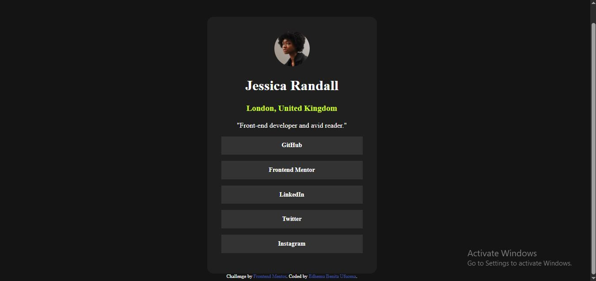

# Frontend Mentor - Social links profile solution

This is a solution to the [Social links profile challenge on Frontend Mentor](https://www.frontendmentor.io/challenges/social-links-profile-UG32l9m6dQ).

## Welcome! 👋

Thanks for checking out this front-end coding challenge.

### The challenge

Users should be able to:
See hover and focus states for all interactive elements on the page.

### Screenshot

### Links

- Solution URL: [Solution URL here]()
- Live Site URL: [Live site URL here]()

### Built with

- Semantic HTML5 markup
- CSS custom properties
- Flexbox
- CSS Grid
- Mobile-first workflow

## Author

- Frontend Mentor - [@Bennyufy](https://www.frontendmentor.io/profile/Bennyufy)
- Github - [@Bennyufy](https://github.com/Bennyufy)
